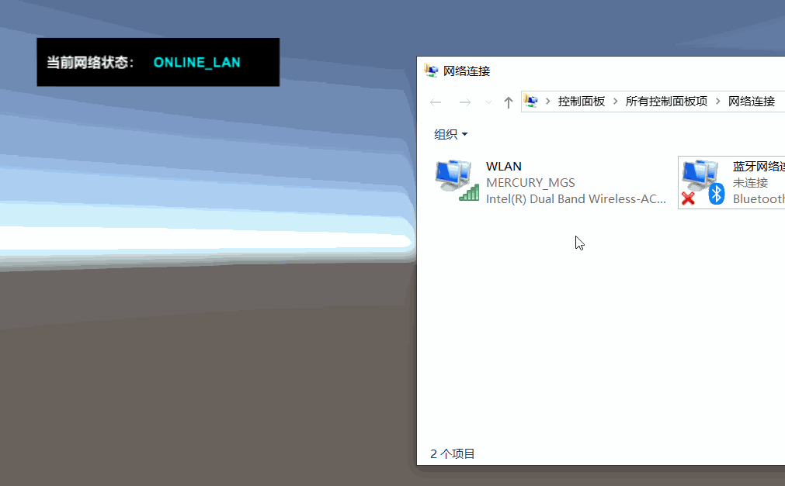
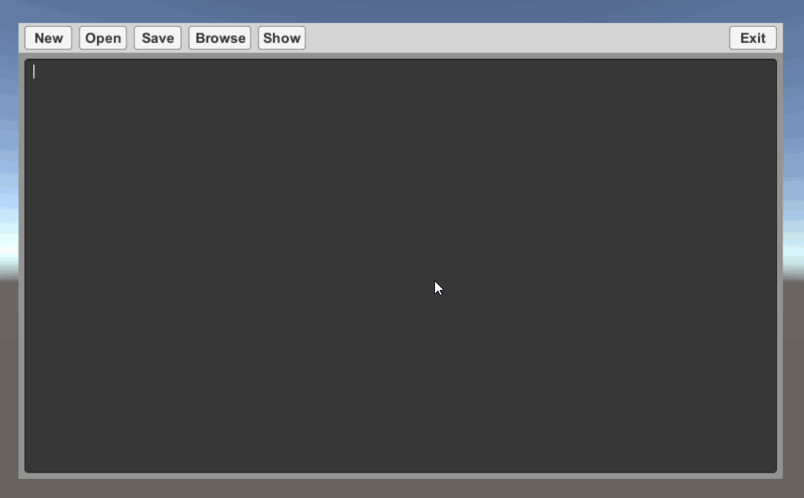

[TOC]

# MGS.WinUtility

## Summary

- Windows utility for unity project develop.

## Environment

- Unity 5.0 or above.
- .Net Framework 3.5 or above.

## Platform

- Windows


## Module

### NetworkUtility

- Usage

  ```C#
  //Network connect state.
  var state = NetworkUtility.GetNetworkConnectState();
  ```

- Preview

  

### ComdlgUtility

- Usage

  ```C#
  //string title, string directory, string filter.
  var selectFile = ComdlgUtility.OpenFileDialog("Open File", workDir, "Text(*.txt)\0*.txt");
  
  //string title, string directory, string defaultName, string filter.
  var saveFile = ComdlgUtility.SaveFileDialog("Save File", workDir, fileName, "Text(*.txt)\0*.txt");
  
  //string title.
  var folder = ComdlgUtility.OpenFolderDialog("Open Folder");
  ```

- Preview

  

### ExplorerUtility

- Usage

  ```C#
  //string path, bool select = true, bool eMode = true
  ExplorerUtility.Show(workDir, false);
  ```

## Demo

- Demos in the path "MGS.Packages/WinUtility/Demo/" provide reference to you.

------

Copyright © 2022 Mogoson.	mogoson@outlook.com
